# ARCNET
Autocatalytic, Relativistic, Curvature, **Net**work

## Autocatalytic Abstraction Networks (AANs)

Conventional ML systems are static learners: fixed objectives, fixed architectures, fixed inductive biases. Even AutoML, meta-learning, or neural architecture search operate within sandboxed limits. AANs instead:

Continuously evolve their own internal abstractions, representations, and architectural modules through a process similar to autocatalytic chemical networks in origin-of-life theories.

#### On Self-Organizing Architectures
While not explicitly autocatalytic, modern ML models learn hierarchies of abstractions:

- Convolutional Neural Networks (CNNs) learn from pixels -> edges -> textures -> objects.

- Transformers in NLP or vision (e.g., GPT, BERT, ViT) learn compositional, context-aware representations that feed into deeper ones.

- These representations bootstrap one another during training, a primitive form of abstraction catalysis.

However, these networks require external data and supervision; they are not autocatalytic in the self-sustaining sense.

**DreamCoder** in particular comes very close:
- It discovers reusable abstractions (like functions or patterns),

- Learns how to use them to solve new problems,

- And improves its own language of thought over time.

This is an explicit example of an abstraction network with *partial* autocatalytic features. To fully qualify as an autocatalytic abstraction network, a system would need to:

1. Generate its own abstractions
2. Use those to create further abstractions
3. Do this recursively and indefinitely
4. Without heavy external steering

We're going to see if we can improve the process of higher-order abstractions and maintaining accuracy by incorporating manifold folding of abstractions in a 3d space. 

***
## What if we add QISRL (Learning in Curved Decision Spaces)

Curved State-Time Embedding
Rather than modeling the environment as a flat vectorized state, we embed it into a curved latent manifold whose local geometry is conditioned on:

- Information gain
- Reward potential density
- Causality distance (measured via temporal counterfactuals)

### Dynamic Temporal Relativity
We introduce a non-uniform "flow of time" in the RL policy, i.e., the policy updates itself more rapidly in high-entropy, high-surprise regions and slows down in stable ones.
A time-weighted Bellman equation is derived:

$$
Q(s,a) = r(s,a) + \gamma(s) \max\limits_{a'} Q(s',a')
$$

where $\gamma(s) = e^{-\lambda H(s)}$ and $H(s)$ is the entropy or information uncertainty at state $s$.

Inspired by general relativity, we define a metric tensor over the state space that warps distances:

$$
ds^2 = g_{ij}(x) dx^i dx^j
$$

where $g_{ij}(x)$ is learned via a neural net based on reqard curvature and transition predictability.

Instead of choosing a discrete action, the agent holds a superposition of policy branches weighted by complex-valued amplitudes, which collapse during high-reward observations. It’s not quantum computing only inspired.

***
## Architecture Workflow Diagram 

To avoid scrolling, `ARCNET.core.trainer` was broken down into horizontal sections meant to be read L -> R. Any arrow coming off a subgraph (e.g., "Initialization") is coming from the RIGHT MOST block in the workflow diagram. This is most confusing for 'Lineage & Pruning' where the arrows "Yes" and "No" are both coming from "All Steps Done?".

```mermaid
---
config:
  layout: elk
---
flowchart TD
 subgraph Init["Initialization"]
    direction LR
        B{"Enable Model Save?"}
        A["Start: run_aan_comprehensive_q_learning<br>(core/trainer.py)"]
        E["Initialize Lineage Registry"]
        C["load_and_seed_population_fixed<br>(data/loader.py)"]
        D["Create ConceptModule(s)<br>(models/arcnet_learner.py)"]
  end
 subgraph Data["Data Prep"]
    direction LR
        G["For each Evolution Step (steps)"]
        F["Convert Data to Tensors<br>(core/trainer.py)"]
  end
 subgraph Train["Training Loop"]
    direction LR
        H2{"training_method"}
        H1["For each Module in Population"]
        L["Q-Learning Update<br>(m.update_q, core/QModule.py)"]
        J["Set m.fitness"]
        I1["compute_fitness_adaptive_complexity_enhanced<br>(evolution/fitness.py)"]
        K["Set m.loss, m.fitness = -m.loss"]
        I2["Gradient Descent (compute_loss + optimizer)<br>(evolution/loss.py)"]
  end
 subgraph QBias["Q-Learning & Bias Detection"]
    direction LR
        O{"Enable Bias Elimination?"}
        N["Bias Detection<br>(monitor_prediction_diversity_with_action, evolution/bias.py)"]
        M["Message Passing<br>(comprehensive_manifold_q_message_passing, core/message.py)"]
        Q["Continue"]
        P["catalyst_bias_elimination<br>(evolution/bias.py)"]
  end
 subgraph Track["Model Tracking"]
    direction LR
        R{"track_best_models?"}
        U["Q-Guided Survival Selection<br>(core/trainer.py)"]
        S["Track Best Models/Stats<br>(core/trainer.py)"]
        T["Skip Tracking"]
  end
 subgraph Repro["Reproduction & Mutation"]
    direction LR
        X["Population Update"]
        W["Q-Experience Inheritance<br>(core/QModule.py)"]
        V["Q-Guided Reproduction &amp; Mutation<br>(mutate, choose_action, models/arcnet_learner.py)"]
  end
 subgraph Lineage["Lineage & Pruning"]
    direction LR
        Y{"enable_lineage_snap?"}
        AB{"Lineage Pruning Needed?"}
        Z["save_lineage_snapshot_to_file<br>(data/loader.py)"]
        AA["Skip Snapshot"]
        AE["Next Step or Finish"]
        AC["Prune Lineage Registry<br>(core/trainer.py)"]
        AD["Continue"]
        AF{"All Steps Done?"}
  end
 subgraph Final["Finalization"]
    direction LR
        AH{"enable_model_save?"}
        AG["Theorem Checks &amp; Final Reporting<br>(core/trainer.py)"]
        AJ["Export (END)<br>- Final population of models<br>- Best model overall"]
        AI["export_best_models<br>(data/loader.py)"]
  end
    A --> B
    B -- Yes, Resume --> C
    C --> E
    B -- No, Fresh --> D
    D --> E
    Init --> Data
    F --> G
    Data --> Train
    H1 --> H2
    H2 -- fitness --> I1
    I1 --> J
    J --> L
    H2 -- loss --> I2
    I2 --> K
    K --> L
    Train --> QBias
    M --> N
    N --> O
    O -- Yes, Needed --> P
    P --> Q
    O -- No/Not Needed --> Q
    QBias --> Track
    R -- Yes --> S
    S --> U
    R -- No --> T
    T --> U
    Track --> Repro
    V --> W
    W --> X
    Repro --> Lineage
    Y -- Yes --> Z
    Z --> AB
    Y -- No --> AA
    AA --> AB
    AB -- Yes --> AC
    AC --> AE
    AB -- No --> AD
    AD --> AE
    AE --> AF
    Lineage -- Yes --> Final
    Lineage -- No --> Data
    AG --> AH
    AH -- Yes --> AI
    AI --> AJ
    AH -- No --> AJ
     A:::main
     B:::main
     C:::main
     E:::main
     D:::main
     F:::main
     G:::main
     H1:::main
     H2:::main
     I1:::main
     I1:::op
     J:::main
     L:::main
     L:::qlearn
     I2:::main
     I2:::op
     K:::main
     M:::main
     N:::main
     N:::bias
     O:::main
     P:::main
     P:::bias
     Q:::main
     R:::main
     S:::main
     S:::track
     U:::main
     U:::track
     T:::main
     V:::main
     V:::repro
     W:::main
     W:::repro
     X:::main
     X:::repro
     Y:::main
     Z:::main
     AB:::main
     AA:::main
     AC:::main
     AC:::prune
     AE:::main
     AD:::main
     AF:::main
     AG:::main
     AG:::theorem
     AH:::main
     AI:::main
     AI:::theorem
     AJ:::main
     AJ:::theorem
    classDef main fill:#333333,stroke:#00796b,stroke-width:3px,color:#FFFFFF
    classDef branch fill:#333333,stroke:#fbc02d,stroke-width:3px
    classDef op fill:#333333,stroke:#f57c00,stroke-width:3px
    classDef qlearn fill:#333333,stroke:#7b1fa2,stroke-width:3px
    classDef bias fill:#333333,stroke:#c62828,stroke-width:3px
    classDef track fill:#333333,stroke:#388e3c,stroke-width:3px
    classDef repro fill:#333333,stroke:#1976d2,stroke-width:3px
    classDef pop fill:#333333,stroke:#827717,stroke-width:3px
    classDef prune fill:#333333,stroke:#5d4037,stroke-width:3px
    classDef theorem fill:#333333,stroke:#ad1457,stroke-width:3px

```

## Methods (Theory)

***
***
## Methods:

#### 1. State Space Definition
Let $\mathcal{S}$ be the system state space where each module $m_i^{(t)}$ at time $t$ is defined as:

$$m_i^{(t)} = \{\mathbf{W}_i, \mathbf{b}_i, \mathbf{p}_i^{(t)}, Q_i^{(t)}, f_i^{(t)}, A_i^{(t)}\}$$

Where:

- $\mathbf{W}_i, \mathbf{b}_i$: Neural network parameters  
- $\mathbf{p}_i^{(t)} \in [0,1]^d$: Position on learned manifold $\mathcal{M}$  
- $Q_i^{(t)}$: Q-learning function (neural or tabular)  
- $f_i^{(t)} \in [0,1]$: Fitness score  
- $A_i^{(t)}$: Assembly properties  

#### 2. Core Mathematical Operations

**2.1 Manifold Learning Component**

The system learns a manifold embedding: 

$$
\mathbf{z}_i = \text{Encoder}(\bar{\mathbf{x}}) \rightarrow \mathbf{p}_i^{(0)} = \sigma(\mathbf{z}_i)
$$

Where:  
- $\mathbf{z}_i$: Latent vector for module $i$  
- $\text{Encoder}(\cdot)$: Neural encoder function  
- $\bar{\mathbf{x}}$: Input data  
- $\sigma(\cdot)$: Activation function (e.g., sigmoid)  
- $\mathbf{p}_i^{(0)}$: Initial position on manifold for module $i$  

Geodesic distance on learned manifold: 

$$
d_{\mathcal{M}}(\mathbf{p}_i, \mathbf{p}_j) = 
\begin{cases} 
|\mathbf{p}_i - \mathbf{p}_j|_2 & \text{if } \mathbf{T}_i = \emptyset \\
|\mathbf{T}_i^T(\mathbf{p}_j - \mathbf{p}_i)|_2 \cdot (1 + 0.1|\kappa_i||\mathbf{T}_i^T(\mathbf{p}_j - \mathbf{p}_i)|_2) & \text{otherwise} 
\end{cases}
$$

Where:  
- $d_{\mathcal{M}}(\mathbf{p}_i, \mathbf{p}_j)$: Geodesic distance between modules $i$ and $j$  
- $\mathbf{p}_i, \mathbf{p}_j$: Positions on manifold  
- $\mathbf{T}_i$: Tangent space at $\mathbf{p}_i$  
- $\kappa_i$: Curvature at $\mathbf{p}_i$  
- $|\cdot|_2$: Euclidean norm  

**2.2 Q-Learning Evolution Dynamics**

Each module maintains a Q-function $Q_i: \mathcal{S} \times \mathcal{A} \rightarrow \mathbb{R}$ updated via: 

$$
Q_i(s,a) \leftarrow Q_i(s,a) + \alpha[R(m_{\text{child}}) + \gamma \max_{a'} Q_i(s',a') - Q_i(s,a)]
$$

Where:  
- $Q_i(s,a)$: Q-value for state $s$ and action $a$ for module $i$  
- $\alpha$: Learning rate  
- $R(m_{\text{child}})$: Reward for child module  
- $\gamma$: Discount factor  
- $s'$: Next state  
- $a'$: Next action  
- $\max_{a'} Q_i(s',a')$: Maximum Q-value for next state  

Proof of Q-Learning Convergence: Under standard assumptions (bounded rewards, sufficient exploration), this satisfies the Robbins-Monro conditions, guaranteeing convergence to $Q^*$.

**2.3 Multi-Objective Fitness Function**

The adaptive fitness function implements a time-varying optimization:

$$
F_i^{(t)} = w_1^{(t)} \cdot \text{Accuracy}_i + w_2^{(t)} \cdot \text{Diversity}_i + w_3^{(t)} \cdot \text{Entropy}_i - \text{Penalty}_i^{(t)}
$$

Where:  
- $F_i^{(t)}$: Fitness of module $i$ at time $t$  
- $w_1^{(t)}, w_2^{(t)}, w_3^{(t)}$: Time-varying weights  
- $\text{Accuracy}_i$: Accuracy metric for module $i$  
- $\text{Diversity}_i$: Diversity metric  
- $\text{Entropy}_i$: Entropy metric  
- $\text{Penalty}_i^{(t)}$: Penalty term at time $t$  

Weights evolve as: 

$$
w^{(t)} = 
\begin{cases} 
(1.5w_n, 1.2w_e, 0.8w_a) & \text{if } t < 0.3T \\
(w_n, w_e, w_a) & \text{if } 0.3T \leq t < 0.7T \\
(0.7w_n, 0.8w_e, 1.3w_a) & \text{if } t \geq 0.7T 
\end{cases}
$$

Where:  
- $w_n, w_e, w_a$: Base weights for accuracy, diversity, and entropy  
- $T$: Total time steps  
- $t$: Current time step  

#### 3. Autocatalytic Assembly Dynamics

The assembly complexity grows according to: 

$$
A_{\text{sys}}^{(t)} = \frac{1}{|\mathcal{P}|} \sum_{i=1}^{|\mathcal{P}|} e^{a_i} \cdot \frac{n_i - 1}{|\mathcal{P}|}
$$

Where:  
- $A_{\text{sys}}^{(t)}$: System assembly complexity at time $t$  
- $|\mathcal{P}|$: Population size  
- $a_i$: Assembly complexity of module $i$  
- $n_i$: Copy number of module type $i$  

Assembly Theorem: Under controlled catalysis, the system complexity $A_{\text{sys}}^{(t)}$ is bounded by: 

$$
A_{\text{sys}}^{(t)} \leq C \cdot \log(t) + A_0
$$

Where:  
- $C$: Constant  
- $A_0$: Initial complexity  
- $t$: Time step  

Proof Sketch: The exponential assembly growth is constrained by the bias elimination mechanism and survivor selection, creating a logarithmic upper bound.

#### 4. Bias Elimination Mechanism

The system implements an adaptive bias detection function: 

$$
\text{Bias}(m_i, t) = \max_k P(y_i = k | \mathbf{x}) - \text{threshold}(t)
$$

Where:  
- $\text{Bias}(m_i, t)$: Bias for module $i$ at time $t$  
- $P(y_i = k | \mathbf{x})$: Probability of class $k$ given input $\mathbf{x}$  
- $\text{threshold}(t)$: Adaptive threshold at time $t$  

Where $\text{threshold}(t) = 0.75 + 0.2 \cdot \frac{t}{T}$ creates an adaptive tolerance.

- $T$: Total time steps  
- $t$: Current time step  

Anti-Convergence Theorem: The bias elimination ensures population diversity: 

$$
\lim_{t \rightarrow \infty} \mathbb{E}[\text{Entropy}(\mathcal{P}^{(t)})] \geq H_{\min} > 0
$$

Where:  
- $\mathbb{E}[\text{Entropy}(\mathcal{P}^{(t)})]$: Expected entropy of population at time $t$  
- $H_{\min}$: Minimum entropy bound  

#### 5. Message Passing and Information Flow

For each module $m_i$, select neighbors by manifold distance: 

$$
\mathcal{N}_{\mathcal{M}}(m_i) = \{m_j : d_{\mathcal{M}}(\mathbf{p}_i, \mathbf{p}_j) \text{ among } k \text{ smallest}\}
$$

Where:  
- $\mathcal{N}_{\mathcal{M}}(m_i)$: Set of $k$ nearest neighbors to $m_i$ on the manifold  
- $d_{\mathcal{M}}(\mathbf{p}_i, \mathbf{p}_j)$: Manifold distance between $i$ and $j$  
- $k$: Number of neighbors  

Information propagates via manifold-aware messaging: 

$$
\mathbf{M}_i^{(t)} = \sigma(g_i) \cdot \frac{1}{|\mathcal{N}_{\mathcal{M}}(m_i)|} \sum_{j \in \mathcal{N}_{\mathcal{M}}(m_i)} \frac{\mathbf{h}_j^{(t-1)}}{1 + d_{\mathcal{M}}(\mathbf{p}_i, \mathbf{p}_j)}
$$

Where:  
- $\mathbf{M}_i^{(t)}$: Message received by module $i$ at time $t$  
- $\sigma(g_i)$: Activation function applied to gating variable $g_i$  
- $|\mathcal{N}_{\mathcal{M}}(m_i)|$: Number of neighbors  
- $\mathbf{h}_j^{(t-1)}$: Hidden state of neighbor $j$ at previous time  
- $d_{\mathcal{M}}(\mathbf{p}_i, \mathbf{p}_j)$: Manifold distance  

Information Flow Theorem: Under connected manifold topology, information propagates globally in $O(\log n)$ steps.

#### 6. Main Convergence Proof

Theorem (AAN-Q Global Convergence): Under the following conditions:

- Bounded fitness landscape: $F: \mathcal{S} \rightarrow [0,1]$
- Sufficient exploration: $\epsilon$-greedy Q-learning with $\epsilon > 0$
- Controlled bias elimination: $|\text{eliminated}| \leq \alpha |\mathcal{P}|$ per step
- Manifold Lipschitz continuity: $|F(\mathbf{p}_1) - F(\mathbf{p}_2)| \leq L \cdot d_{\mathcal{M}}(\mathbf{p}_1, \mathbf{p}_2)$

The system converges to a stable configuration: 

$$
\lim_{t \rightarrow \infty} \mathbb{E}[F_{\text{best}}^{(t)}] = F^* - \delta
$$

Where:  
- $\mathbb{E}[F_{\text{best}}^{(t)}]$: Expected best fitness at time $t$  
- $F^*$: Optimal fitness  
- $\delta$: Exploration-exploitation gap  

Proof Strategy:

- Q-Learning Convergence: Standard MDP theory guarantees $Q_i \rightarrow Q_i^*$
- Manifold Regularization: The geodesic distance creates smooth fitness landscapes
- Population Dynamics: Bias elimination prevents premature convergence
- Assembly Constraints: Bounded complexity prevents runaway growth

#### 7. Computational Complexity

The algorithm has complexity:

Per Step: $O(n^2 d + n \cdot |Q|)$ where $n = |\mathcal{P}|$, $d$ = manifold dimension

Overall: $O(T \cdot n^2 d)$ for $T$ evolution steps

Where:  
- $n$: Population size  
- $d$: Manifold dimension  
- $|Q|$: Size of Q-table or Q-function  
- $T$: Number of evolution steps  

#### 8. System Complexity

**8.1 Assembly Theory Metric**

$$
A_{\text{sys}}^{(t)} = \frac{1}{|\mathcal{P}|} \sum_{i=1}^{|\mathcal{P}|} e^{a_i} \cdot \frac{n_i - 1}{|\mathcal{P}|}
$$

Where:  
- $A_{\text{sys}}^{(t)}$: System assembly complexity at time $t$  
- $|\mathcal{P}|$: Population size  
- $a_i$: Assembly complexity of module $i$  
- $n_i$: Copy number of module type $i$  

Each neural module (`ConceptModule`) tracks the minimal assembly complexity of it's weights. 
- Each layer's weights are wrapped in `ARCENET.core.ModuleComponent` that records the pathway
- When a module is mutated, new components are created with parent references, enabling reuse tracking
- The per-layer and total assemble complexity can be queried for any module with `ARCENET.models.arcnet_learner.system_assembly_complexity`
- System-level complexity is computed as the formula above, using the sum of exponentiated assembly indicies

#### 9. Complete System Evolution

The system evolves according to: 

$$
\mathcal{P}^{(t+1)} = \text{Select}(\mathcal{P}^{(t)}) \cup \text{Mutate}(\text{Select}(\mathcal{P}^{(t)}), Q^{(t)})
$$

Where:  
- $\mathcal{P}^{(t)}$: Population at time $t$  
- $\text{Select}(\cdot)$: Selection operator  
- $\text{Mutate}(\cdot, Q^{(t)})$: Mutation operator using Q-function $Q^{(t)}$  

With the objective of maximizing: 

$$
\mathcal{L} = \mathbb{E}_{t,i}\left[ R(m_i^{(t)}) \right] - \lambda A_{\text{sys}}^{(t)}
$$

Where:  
- $\mathcal{L}$: Objective function  
- $R(m_i^{(t)})$: Reward for module $i$ at time $t$  
- $\lambda$: Regularization parameter  
- $A_{\text{sys}}^{(t)}$: System assembly complexity at time $t$  

***
***
