# ARCNET
Autocatalytic, Relativistic, Curvature, **Net**work

## Autocatalytic Abstraction Networks (AANs)

Conventional ML systems are static learners: fixed objectives, fixed architectures, fixed inductive biases. Even AutoML, meta-learning, or neural architecture search operate within sandboxed limits. AANs instead:

Continuously evolve their own internal abstractions, representations, and architectural modules through a process similar to autocatalytic chemical networks in origin-of-life theories.

#### On Self-Organizing Architectures
While not explicitly autocatalytic, modern ML models learn hierarchies of abstractions:

- Convolutional Neural Networks (CNNs) learn from pixels -> edges -> textures -> objects.

- Transformers in NLP or vision (e.g., GPT, BERT, ViT) learn compositional, context-aware representations that feed into deeper ones.

- These representations bootstrap one another during training, a primitive form of abstraction catalysis.

However, these networks require external data and supervision; they are not autocatalytic in the self-sustaining sense.

**DreamCoder** in particular comes very close:
- It discovers reusable abstractions (like functions or patterns),

- Learns how to use them to solve new problems,

- And improves its own language of thought over time.

This is an explicit example of an abstraction network with *partial* autocatalytic features. To fully qualify as an autocatalytic abstraction network, a system would need to:

1. Generate its own abstractions
2. Use those to create further abstractions
3. Do this recursively and indefinitely
4. Without heavy external steering

We're going to see if we can improve the process of higher-order abstractions and maintaining accuracy by incorporating manifold folding of abstractions in a 3d space. 

***
## What if we add QISRL (Learning in Curved Decision Spaces)

Curved State-Time Embedding
Rather than modeling the environment as a flat vectorized state, we embed it into a curved latent manifold whose local geometry is conditioned on:

- Information gain
- Reward potential density
- Causality distance (measured via temporal counterfactuals)

### Dynamic Temporal Relativity
We introduce a non-uniform "flow of time" in the RL policy, i.e., the policy updates itself more rapidly in high-entropy, high-surprise regions and slows down in stable ones.
A time-weighted Bellman equation is derived:

$$
Q(s,a) = r(s,a) + \gamma(s) \max\limits_{a'} Q(s',a')
$$

where $\gamma(s) = e^{-\lambda H(s)}$ and $H(s)$ is the entropy or information uncertainty at state $s$.

Inspired by general relativity, we define a metric tensor over the state space that warps distances:

$$
ds^2 = g_{ij}(x) dx^i dx^j
$$

where $g_{ij}(x)$ is learned via a neural net based on reqard curvature and transition predictability.

Instead of choosing a discrete action, the agent holds a superposition of policy branches weighted by complex-valued amplitudes, which collapse during high-reward observations. It’s not quantum computing only inspired.

***
## Architecture Workflow Diagram 

```mermaid
flowchart TD
    %% Initialization
    A["Start: run_aan_comprehensive_q_learning<br/>(core/trainer.py)"] --> B{Enable Model Save?}
    B -- Yes, Resume --> C["load_and_seed_population_fixed<br/>(data/loader.py)"]
    B -- No, Fresh --> D["Create ConceptModule(s)<br/>(models/arcnet_learner.py)"]
    C --> E["Initialize Lineage Registry"]
    D --> E
    E --> F["Convert Data to Tensors<br/>(core/trainer.py)"]
    F --> G["For each Evolution Step (steps)"]
    G --> H1["For each Module in Population"]
    %% Training method branch
    H1 --> H2{training_method}
    H2 -- "fitness" --> I1["compute_fitness_adaptive_complexity_enhanced<br/>(evolution/fitness.py)"]
    H2 -- "loss" --> I2["Gradient Descent (compute_loss + optimizer)<br/>(evolution/loss.py)"]
    I1 --> J["Set m.fitness"]
    I2 --> K["Set m.loss, m.fitness = -m.loss"]
    J --> L
    K --> L
    %% Q-Learning
    L["Q-Learning Update<br/>(m.update_q, core/QModule.py)"] --> M["Message Passing<br/>(comprehensive_manifold_q_message_passing, core/message.py)"]
    %% Bias detection
    M --> N["Bias Detection<br/>(monitor_prediction_diversity_with_action, evolution/bias.py)"]
    N --> O{Enable Bias Elimination?}
    O -- Yes, Needed --> P["catalyst_bias_elimination<br/>(evolution/bias.py)"]
    O -- No/Not Needed --> Q["Continue"]
    P --> Q
    %% Tracking
    Q --> R{track_best_models?}
    R -- Yes --> S["Track Best Models/Stats<br/>(core/trainer.py)"]
    R -- No --> T["Skip Tracking"]
    S --> U
    T --> U
    %% Survival selection
    U["Q-Guided Survival Selection<br/>(core/trainer.py)"] --> V["Q-Guided Reproduction & Mutation<br/>(mutate, choose_action, models/arcnet_learner.py)"]
    V --> W["Q-Experience Inheritance<br/>(core/QModule.py)"]
    W --> X["Population Update"]
    X --> Y{enable_lineage_snap?}
    Y -- Yes --> Z["save_lineage_snapshot_to_file<br/>(data/loader.py)"]
    Y -- No --> AA["Skip Snapshot"]
    Z --> AB
    AA --> AB
    AB{Lineage Pruning Needed?}
    AB -- Yes --> AC["Prune Lineage Registry<br/>(core/trainer.py)"]
    AB -- No --> AD["Continue"]
    AC --> AE["Next Step or Finish"]
    AD --> AE
    AE --> AF{All Steps Done?}
    AF -- No --> G
    AF -- Yes --> AG["Theorem Checks & Final Reporting<br/>(core/trainer.py)"]
    AG --> AH{enable_model_save?}
    AH -- Yes --> AI["export_best_models<br/>(data/loader.py)"]
    AH -- No --> AJ["Return Results"]
    AI --> AJ
    AJ["Export (END)
    - Final population of models
    - Best model overall"]

    %% Math/Proof Annotations (as comments)
    %% - Fitness/Loss boundedness: I1, I2
    %% - Q-learning convergence: L
    %% - Manifold message passing: M
    %% - Bias elimination theorem: N, P
    %% - Survival selection optimality: U
    %% - Reproduction diversity: V
    %% - Q-knowledge transfer: W
    %% - Global convergence: AG

    %% Styling for clarity
    classDef main fill:#333333,stroke:#00796b,stroke-width:3px;
    classDef branch fill:#333333,stroke:#fbc02d,stroke-width:3px;
    classDef op fill:#333333,stroke:#f57c00,stroke-width:3px;
    classDef qlearn fill:#333333,stroke:#7b1fa2,stroke-width:3px;
    classDef bias fill:#333333,stroke:#c62828,stroke-width:3px;
    classDef track fill:#333333,stroke:#388e3c,stroke-width:3px;
    classDef repro fill:#333333,stroke:#1976d2,stroke-width:3px;
    classDef pop fill:#333333,stroke:#827717,stroke-width:3px;
    classDef prune fill:#333333,stroke:#5d4037,stroke-width:3px;
    classDef theorem fill:#333333,stroke:#ad1457,stroke-width:3px;

    linkStyle default stroke:grey, stroke-width:3px


    class A,B,C,D,E,F,G,H1,H2,I1,I2,J,K,L,M,N,O,P,Q,R,S,T,U,V,W,X,Y,Z,AA,AB,AC,AD,AE,AF,AG,AH,AI,AJ main;
    class I1,I2 op;
    class L qlearn;
    class N,P,U bias;
    class V,W,X repro;
```

***

